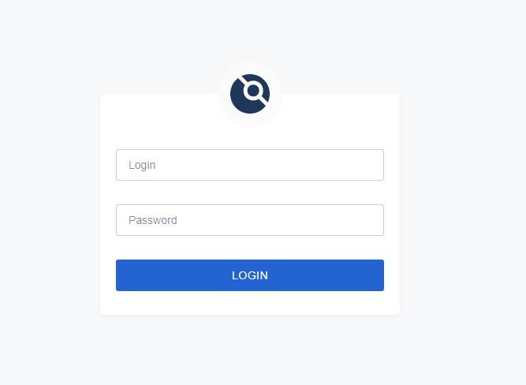
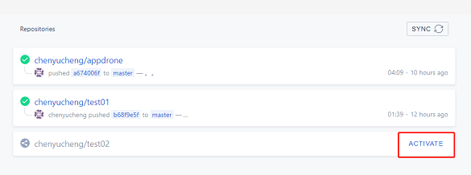
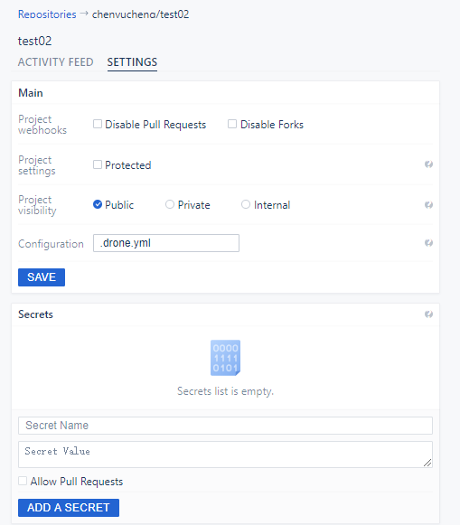
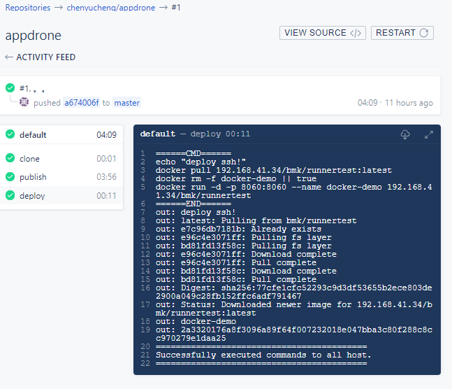

# devops/cd-tool

###drone 1.x 版本、gitea 搭建 CI/CD 说明：
#### 1. 启动服务
-  1.编辑 run.sh 中的配置信息，使用 run.sh 启动drone服务。
-  2.在gitea创建一个drone的用户，需要有创建钩子的权限，管理员在项目的仓库设置里面把drone用户加入协作者
-  3.在浏览器中访问 drone_server_host(run.sh中配置的server_host),使用刚刚gitea创建的drone用户登录
-  4.登录后在项目列表中选择所需要激活的项目，点击ACTIVATE，跳转到配置页面增加 DOCKER_PASSWORD 和 HOST_PASSWORD 这两个secret  
     它们是.drone.yml里面docker用户的密码和测试机的密码, 点击保存,成功后drone会在gitea中对应的项目中自动添加webhook

注意：前面2步由管理员操作，后面需要开发者自己操作查看








#### 2. pipeline 文件配置
   - drone 默认使用项目路径下的 .drone.yml，可配置其它文件名，详细编写可参考drone官网：
   <https://docs.drone.io/user-guide/pipeline/>
   - drone只负责启动容器，各个阶段都对应一个容器，具体操作在各阶段容器中进行。各阶段容器可使用已提供的容器插件:
   <http://plugins.drone.io/drone-plugins/>，也可在github中寻找适用的镜像或自己编写镜像。
   - 建议项目自带 Dockerfile，drone会在publish阶段自动使用 Dockerfile 构建项目镜像，也可在pipeline中配置专门的构建阶段。
   
   
#### 3. 事件
   - drone支持所有git事件：
   
      - when: 限制运行时 pipeline step 的执行
      - trigger: 限制运行时的 pipeline 执行
      - 详细请看官网说明
      ```
      kind: pipeline
      name: default
      
      steps:
      - name: build
        image: golang
        commands:
        - go build
        - go test
        when:
          branch:
          - master
          - feature/*
      ```  
      
      ```
      kind: pipeline
      
      steps:
      - name: build
        image: golang
        commands:
        - go build
        - go test
      
      trigger:
        branch:
        - master
      ```      
    
      
#### 4. CI/CD
   - 一切配置就绪之后，触发事件会 drone 会依据提供的 .drone.yml 提供的配置执行，可在 drone 后台页面查看执行情况。
   - 构建---发布--部署
   


